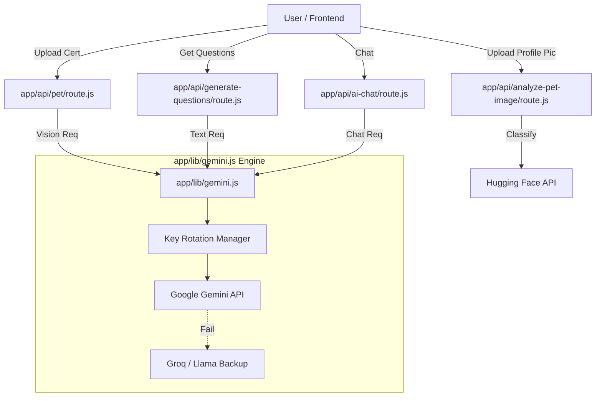

# AI System Architecture & Data Flow

This document outlines the architecture of the AI system within the Pet-Mat
application, focusing on the central processing engine and its various consumer
endpoints.

## 1. The Core Engine: `app/lib/gemini.js`

This file serves as the centralized **Gateway** and **Load Balancer** for all
GenAI operations. It does not contain business logic for specific features but
rather manages the connectivity and reliability of the AI services.

### Key Responsibilities:

- **API Key Management**: Implements a rotation strategy for Google Gemini API
  keys to distribute load and prevent rate limiting. It fetches active keys from
  the MongoDB `GeminiKey` collection.
- **Hybrid Failover System ("The Shield")**:
  - **Primary Layer**: Attempts to use Google's **Gemini Flash/Pro** models
    first.
  - **Backup Layer**: If all Gemini keys fail (due to rate limits or outages),
    it automatically switches to **Groq** (running Llama 3 models) to ensure
    service continuity.
- **Standardized Exports**: Provides two main client instances for the
  application:
  - `textModel`: For text generation and chat interfaces.
  - `visionModel`: For multimodal tasks (image analysis).

---

## 2. API Data Flow

The `gemini.js` engine is consumed by various API routes. The data flow
generally follows this pattern:

`Client (Frontend)` -> `Next.js API Route` -> `app/lib/gemini.js` ->
`External AI Provider (Google/Groq)`

### Consumer Routes Details

#### A. Pet Certificate Verification

- **File**: `app/api/pet/route.js`
- **Function**: Verifies the authenticity of pet certificates during the "Add
  Pet" flow.
- **Process**:
  1. Receives the uploaded certificate image.
  2. Calls `visionModel.generateContent` with a strict prompt to extract OCR
     data (Pet Name, Owner Name, Age, Vaccinations).
  3. Compares the extracted Owner Name with the logged-in User's name.
  4. Returns a status of `verified`, `rejected`, or `needs-review`.

#### B. Question Generation

- **File**: `app/api/generate-questions/route.js`
- **Function**: Creates dynamic, personality-driven questions for users to
  answer about their pets.
- **Process**:
  1. Receives Pet Name, Breed, and Type.
  2. Calls `textModel.generateContent` to generate 10 custom questions.
  3. Includes a hardcoded fallback list in case of total AI failure.

#### C. AI Advisor (Chatbot)

- **File**: `app/api/ai-advisor/chat/route.js`
- **Function**: Provides a conversational interface for pet care advice.
- **Process**:
  1. Manages chat history and context.
  2. Streams responses via `textModel.startChat` or `sendMessage`.

#### D. Recommendation Engine

- **File**: `app/api/marketplace/recommendations/route.js` &
  `app/api/predict/route.js`
- **Function**: Analyzes pet data to suggest products or health insights.

---

## 3. Notable Exception: Image Classification using Hugging Face

- **File**: `app/api/analyze-pet-image/route.js`
- **Library**: `app/lib/huggingface.js`
- **Context**: This specific route was migrated **away from Gemini** to use a
  specialized Hugging Face model (`google/vit-base-patch16-224`).
- **Purpose**: Strictly used for **Classification** (e.g., "Is this a Dog, Cat,
  or Human?"). It prevents users from uploading photos of humans as pet profile
  pictures.

---

## Summary Diagram

